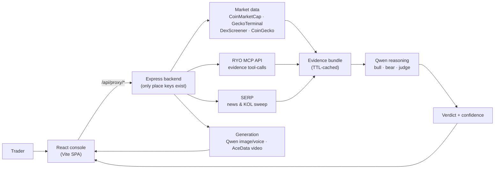

<div align="center">


# Verdict Agent

**Live crypto token forensics, decided by an agent council — not by hype.**

Drop in a ticker or contract address. Verdict Agent gathers real-time market, on-chain, news and social evidence, runs an adversarial bull-vs-bear debate over it, and issues one defensible verdict with risk sizing and shareable media.

[**Live Demo →**](https://verdict-agent-p1mj.onrender.com) · [Demo Video](#demo-video) · [How It Works](#how-it-works) · [Architecture](#architecture) · [Quick Start](#quick-start)


</div>

---

## At a Glance

| | |
|---|---|
| **Agents** | 9 specialized analysis agents + an adversarial council |
| **Studios** | 3 generation studios (video · image · voice) |
| **Live sources** | 6 vendor integrations, zero mock data anywhere |
| **Reasoning** | Bull desk vs bear desk vs judge — explicit, sourced, auditable |
| **Stance vocabulary** | `POSITIVE` · `NEUTRAL` · `CAUTION` — never "buy/sell" |
| **Disclosure** | DYOR disclaimer on every single screen |

## Why It Exists

Retail crypto research is fragmented: price on one site, holders on another, sentiment on a third — and "analysis" usually means someone's thread. Verdict Agent compresses the entire research loop into one console where **every number is fetched live, every claim is sourced, and every conclusion is the output of an explicit reasoning pipeline**. It never tells you what to do; it shows the evidence, the debate and the confidence, then gets out of your way.

## Key Features

| Agent / Page | What it does |
|---|---|
| **Market Overview** | Regime, breadth, fear & greed, BTC dominance, top movers — the macro frame before any token call |
| **Token Analysis** | Full forensic profile: price, cap, volume, holders, volatility, history, catalysts, risks |
| **Deep Analysis** | Five-pillar verdict engine (technical · market · risk · catalyst · sentiment) with reasoned signal |
| **Bull vs Bear (Council)** | Adversarial debate: bull and bear desks argue the same live evidence; a judge model rules and writes the verdict |
| **Sentiment Shift** | 7-day social/news sentiment drift with turning-point detection |
| **KOL Radar** | Real posts from real voices, swept live, each stamped with stance, impact and conviction; narrative convergence read |
| **Risk Desk** | If you were going to act: position sizing, invalidation stops, targets and conviction gates |
| **Final Verdict** | The signed receipt — every agent merged into a single ruling with confidence |
| **Compare / Scout** | Side-by-side token comparison and momentum scanning |
| **Studios (Video · Image · Voice)** | Turn the live verdict into shareable media: motion clip, verdict card art, narrated brief |

Every wait state is honest: a **percentage loader** while evidence is gathered, a **generation loader** while media renders. No screen ever shows placeholder or invented data.

## How It Works

1. **Resolve** — ticker/address resolves to a canonical token identity (sticky-cached).
2. **Gather evidence** — the backend pulls live market structure, news and web search, and social/KOL sweeps; each endpoint is TTL-cached server-side to respect API credits.
3. **Reason** — separate LLM personas (bull desk, bear desk, judge, narrative analyst) run over the *same* evidence bundle with tool-grade prompts; prompts never surface in the UI.
4. **Rule** — the judge synthesizes a stance (`POSITIVE / NEUTRAL / CAUTION`) plus confidence and a reasoning trace.
5. **Act & share** — Risk Desk converts the verdict into sizing guidance; Studios render it into video, card art or narration.
6. **Disclose** — every page carries the DYOR disclaimer. Nothing here is financial advice.

## Architecture



- **Keys never leave the server.** The frontend only talks to our own proxy; all vendor credentials are server-side environment variables. Nothing secret is committed — `.gitignore` blocks every env file, and git history contains none.
- **Credit-conscious caching.** In-memory TTL cache (5–30 min per endpoint): repeat opens are instant, vendor calls are not wasted.
- **Real data only.** If a source fails, the UI says so — it never substitutes fake numbers.

## Repository Structure

```
verdict-app/
├─ public/                  # static assets (app icon)
├─ src/                     # React console (Vite)
│  ├─ components/           # shell, cards, badges, loaders/ (Uiverse CSS modules)
│  ├─ hooks/                # useAgentData — fetch + loading/error states
│  ├─ lib/                  # proxy client, stance vocabulary, art helpers
│  ├─ pages/                # landing, verdict flow, dashboard agents + studios
│  ├─ App.jsx               # routes
│  └─ index.css             # design system
├─ server/                  # Express proxy — the only place keys exist
│  ├─ lib/                  # marketData · llm · acedata · serp · cache · stance …
│  ├─ routes/               # resolve · ryo · synthesis · studio
│  └─ index.js              # serves /api + the built frontend
├─ render.yaml              # one-click Render blueprint (variable names only)
├─ LICENSE                  # MIT
└─ README.md                # you are here
```

## Quick Start

```bash
git clone <this-repo> && cd verdict-app
npm install                 # frontend deps
npm --prefix server install # backend deps
# create server/.env with the variables below (values stay local)
npm run dev:full            # frontend :3000 + backend :4000
```

Environment variables (names only — set values in `server/.env` locally or in the Render dashboard):
`RYO_MCP_BASE` · `RYO_MCP_KEY` · `QWEN_KEY` · `CMC_API_KEY` · `ACEDATA_KEY` · optional model overrides (`QWEN_CHAT_MODEL`, `QWEN_IMAGE_MODEL`, `ACEDATA_VIDEO_MODEL`, …)

**Deploy:** push to GitHub → Render reads [render.yaml](render.yaml) → set the five env vars → live. The backend serves the built frontend and the API from one origin, so there is exactly one URL to share.

## Data Sources

| Service | Role |
|---|---|
| CoinMarketCap (pro API) | Primary market data: price, cap, volume, supply |
| GeckoTerminal / DexScreener / CoinGecko | On-chain pools, DEX pairs, token metadata & logos |
| RYO MCP API | Evidence tool-calls: analysis, sentiment, narrative, risk, scanning |
| Qwen (Alibaba DashScope) | Reasoning layer: bull/bear/judge personas, narrative, image & voice generation |
| AceDataCloud | Video generation and TTS fallback models |
| SERP (live web search) | News and KOL post discovery |

## Third-Party Libraries

React 18 (MIT) · Vite 5 (MIT) · Tailwind CSS (MIT) · Framer Motion (MIT) · Recharts (MIT) · Lucide React (ISC) · html-to-image (MIT) · Express (MIT) · Node.js (MIT)

## Demo Video

_Recorded walkthrough uploaded to cloud storage; link (and password, if any) recorded in the committed Application Form._

## Hackathon Submission

- **Track:** stated in the committed Application Form (repository root).
- **Application Form:** downloaded from the organizer channel, completed, committed to `main`.
- **Repository:** all final code, docs and required files live on the `main` branch of the provided repository.

## Security

- API keys are never committed (enforced by `.gitignore`); none exist in git history.
- The backend proxy keeps every third-party credential server-side.
- Studio prompts and model routing are internal; the UI shows outputs, not plumbing.

## License & Disclaimer

Released under the [MIT License](LICENSE).
**Not financial advice.** Crypto assets are volatile and can go to zero. Every screen says it and means it: **do your own research.**
